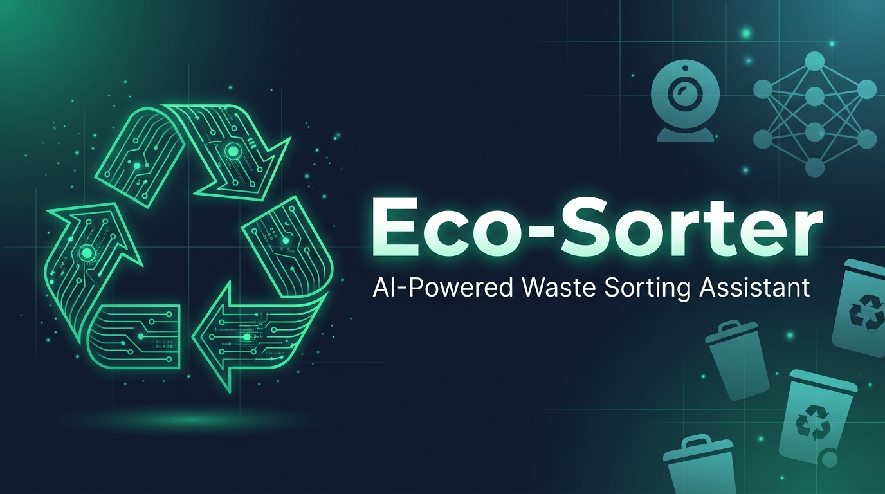

<div align="center">



<br />

# 🌱 Eco-Sorter

**Real-time AI-powered waste sorting assistant using computer vision and local LLMs.**

Point your webcam at an object — Eco-Sorter identifies it, classifies it into the correct European disposal category, and provides recycling guidance with fun facts.

[](LICENSE)
[](https://python.org)
[](https://fastapi.tiangolo.com)
[](https://nextjs.org)
[](docker-compose.yml)
[](https://github.com/matteoespo/eco-sorter/actions)

[Getting Started](#-quick-start) •
[Architecture](#-architecture) •
[Configuration](#-environment-variables) •
[Contributing](CONTRIBUTING.md) •
[Changelog](CHANGELOG.md)

</div>

---

## ✨ Features

- 🎥 **Real-time webcam detection** — Streams at 5 FPS over WebSocket with live bounding box overlays
- 🧠 **YOLO-World XL** — Open-vocabulary object detection with 31 eco-specific classes
- 🤖 **Local LLM guidance** — Gemma 2B via Ollama provides disposal instructions and fun facts, no cloud API needed
- 🎯 **Per-class confidence thresholds** — Tuned thresholds for maximum recall on easy objects, precision on ambiguous ones
- ♻️ **European recycling rules** — 6 disposal categories: Plastic & Metal, Paper & Cardboard, Glass, Organic, Residual Waste, Hazardous
- ⚡ **Smart debounce** — Only queries the LLM after an object is stably detected for 1.5 seconds
- 🐳 **One-command setup** — Fully containerised with Docker Compose

## 🏗 Architecture

```
┌──────────────┐        WebSocket (base64 frames)         ┌──────────────────┐
│              │ ──────────────────────────────────────▶   │                  │
│   Frontend   │                                          │   CV Backend     │
│  (Next.js)   │ ◀──────────────────────────────────────  │  (FastAPI +      │
│  :3000       │   JSON { detections, llm_result }        │   YOLO-World)    │
└──────────────┘                                          │  :8000           │
                                                          └────────┬─────────┘
                                                                   │
                                                          httpx POST (async)
                                                                   │
                                                          ┌────────▼─────────┐
                                                          │                  │
                                                          │   LLM Backend    │
                                                          │  (Ollama +       │
                                                          │   Gemma 2B)      │
                                                          │  :11434          │
                                                          └──────────────────┘
```

| Service | Technology | Purpose | Port |
|---------|-----------|---------|------|
| **frontend** | Next.js 16 (React 19) | Webcam streaming UI with glassmorphism design, live bounding boxes | `3000` |
| **cv-backend** | FastAPI + YOLO-World XL | WebSocket frame processing, object detection with per-class thresholds | `8000` |
| **llm-backend** | Ollama + Gemma 2B | Item classification, disposal advice, and fun facts via JSON API | `11434` |

## 🚀 Quick Start

### Prerequisites

- [Docker](https://docs.docker.com/get-docker/) & [Docker Compose](https://docs.docker.com/compose/install/) v2+
- NVIDIA GPU + [NVIDIA Container Toolkit](https://docs.nvidia.com/datacenter/cloud-native/container-toolkit/install-guide.html) (for the LLM backend)
- Webcam (built-in or USB)

### Run

```bash
# Clone the repository
git clone https://github.com/matteoespo/eco-sorter.git
cd eco-sorter

# Start all services
docker compose up --build

# Open the app
open http://localhost:3000
```

> [!NOTE]
> The first run downloads the YOLO-World XL model (~400 MB) and the Gemma 2B LLM (~1.5 GB). Subsequent runs use cached Docker volumes.

> [!TIP]
> No NVIDIA GPU? You can modify `docker-compose.yml` to remove the GPU reservation from `llm-backend` and use CPU-only inference (slower but functional).

## ⚙️ Environment Variables

All configurable via `docker-compose.yml` → `cv-backend` → `environment`:

| Variable | Default | Description |
|----------|---------|-------------|
| `LLM_URL` | `http://llm-backend:11434/api/generate` | Ollama API endpoint |
| `LLM_MODEL` | `gemma:2b` | LLM model name to use |
| `LLM_TIMEOUT` | `15.0` | HTTP timeout for LLM requests (seconds) |
| `YOLO_MODEL_NAME` | `yolov8x-world.pt` | YOLO-World model weights file |
| `YOLO_WEIGHTS_DIR` | `/app/weights` | Directory for cached model weights |
| `DEFAULT_CONFIDENCE` | `0.20` | Fallback detection confidence threshold |
| `DEBOUNCE_SECONDS` | `1.5` | Seconds to wait before querying the LLM |
| `LOG_LEVEL` | `INFO` | Application log level |

## 📁 Project Structure

```
eco-sorter/
├── services/
│   ├── cv-backend/
│   │   ├── app/
│   │   │   ├── main.py              # FastAPI entrypoint with lifespan hooks
│   │   │   ├── core/
│   │   │   │   ├── config.py         # Settings, eco-classes, thresholds, category map
│   │   │   │   └── logging.py        # Structured logging setup
│   │   │   ├── models/
│   │   │   │   └── schemas.py        # Pydantic request/response models
│   │   │   ├── api/
│   │   │   │   ├── router.py         # Master API router
│   │   │   │   └── endpoints/
│   │   │   │       └── process.py    # WebSocket /process-frame endpoint
│   │   │   └── services/
│   │   │       ├── detector.py       # YOLO-World detection wrapper
│   │   │       └── llm.py           # Async Ollama client (httpx)
│   │   ├── Dockerfile
│   │   ├── requirements.txt
│   │   └── weights/                  # Cached model weights (Docker volume)
│   ├── frontend/                     # Next.js webcam UI
│   └── llm-backend/
│       └── entrypoint.sh            # Ollama server startup + model pull
├── .github/
│   ├── workflows/ci.yml             # CI pipeline (lint + Docker build)
│   ├── ISSUE_TEMPLATE/               # Bug report & feature request templates
│   └── PULL_REQUEST_TEMPLATE.md
├── docker-compose.yml
├── CONTRIBUTING.md
├── CHANGELOG.md
├── LICENSE
└── README.md
```

## 🧪 Key Design Decisions

### Class-Specific Confidence Thresholds

Instead of a single global threshold, each eco-class has its own confidence floor. High-contrast objects (e.g. `plastic bottle` at `0.15`) use lower thresholds for maximum recall, while ambiguous categories (e.g. `electronic device` at `0.25`) use higher thresholds for precision.

### Optimised Class Vocabulary

The original 60+ fine-grained classes caused semantic dilution in YOLO-World's open-vocabulary head. The refactored vocabulary uses ~31 broader, human-recognisable categories that map cleanly to 6 disposal groups: **Plastic & Metal**, **Paper & Cardboard**, **Glass**, **Organic**, **Residual Waste**, and **Hazardous**.

### Async Architecture

The LLM client uses `httpx.AsyncClient` instead of `requests`, preventing frame-processing from blocking during slow LLM generation. The YOLO model inference runs with a `threading.Lock` for thread safety under uvicorn's async workers.

### Debounce Logic

The LLM is only queried after an object has been stably detected for a configurable period (default 1.5s), preventing excessive API calls during rapid scene changes.

## 🛠 Tech Stack

<table>
  <tr>
    <td><b>Computer Vision</b></td>
    <td><a href="https://github.com/AILab-CVC/YOLO-World">YOLO-World</a> (XL variant) — open-vocabulary object detection</td>
  </tr>
  <tr>
    <td><b>Backend API</b></td>
    <td><a href="https://fastapi.tiangolo.com/">FastAPI</a> — async WebSocket and REST API</td>
  </tr>
  <tr>
    <td><b>Frontend</b></td>
    <td><a href="https://nextjs.org/">Next.js 16</a> + React 19 — webcam streaming with glassmorphism UI</td>
  </tr>
  <tr>
    <td><b>LLM Server</b></td>
    <td><a href="https://ollama.ai/">Ollama</a> — local LLM inference, no cloud dependencies</td>
  </tr>
  <tr>
    <td><b>LLM Model</b></td>
    <td><a href="https://ai.google.dev/gemma">Gemma 2B</a> — compact model for classification + text generation</td>
  </tr>
  <tr>
    <td><b>HTTP Client</b></td>
    <td><a href="https://www.python-httpx.org/">httpx</a> — async HTTP for backend-to-LLM communication</td>
  </tr>
  <tr>
    <td><b>Validation</b></td>
    <td><a href="https://docs.pydantic.dev/">Pydantic</a> — data validation and settings management</td>
  </tr>
  <tr>
    <td><b>Container</b></td>
    <td><a href="https://www.docker.com/">Docker</a> + Compose — one-command deployment</td>
  </tr>
</table>

## 🤝 Contributing

Contributions are welcome! Please read the [Contributing Guide](CONTRIBUTING.md) before submitting a pull request.

See also: [Code of Conduct](CODE_OF_CONDUCT.md) · [Security Policy](SECURITY.md)

## 📄 License

This project is licensed under the **MIT License** — see the [LICENSE](LICENSE) file for details.

## 🙏 Acknowledgments

- [Ultralytics](https://ultralytics.com/) for the YOLO-World model and training infrastructure
- [Ollama](https://ollama.ai/) for making local LLM inference dead simple
- [Google DeepMind](https://deepmind.google/) for the Gemma model family

---

<div align="center">

Made with 💚 for a cleaner planet

</div>
